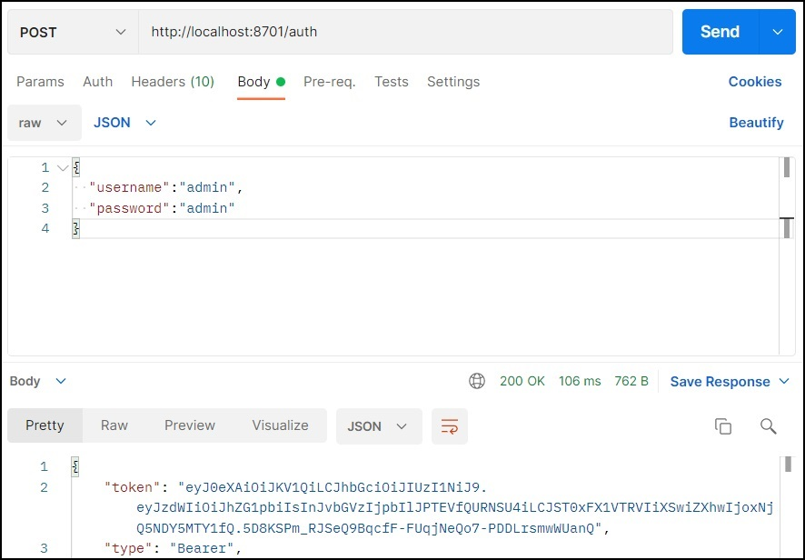

# Микросервис - Client (for MainApp)
> Для взаимодействия с приложением необходимо использовать Postman (или аналог).

> MainApp должен быть запущен.
## Команды:
### 1. Пройти авторизацию по логину и паролю, получить Bearer токен: 
>POST: [localhost:8701/auth](http://localhost:8701/auth)

    {
      "username":"admin",
      "password":"admin"
    }

    {
      "username":"user",
      "password":"user"
    }

> В тело запроса (Body -> raw -> JSON) необходимо вставить пары "username":"логин", "password":"пароль" как показано на рисунке выше.

> После успешной авторизации, вы получите токен аутентификации (в теле ответа), который вам понадобиться на следующем шаге.
---
### 2. Пройти аутентификацию, получить ресурсы (список пользователей):
> GET: [localhost:8701/list]()

> Чтобы получить ресурсы, необходимо пройти аутентификацию, путем добавления заголовка "Authorization"  
> со значением "Bearer ваш_токен" как показано на рисунке выше. 

> Вместо заголовка можно использовать вкладку Auth -> Type (Bearer Token) -> ваш_токен.

> Список ресурсов доступен только для пользователей с правами ROLE_ADMIN 
